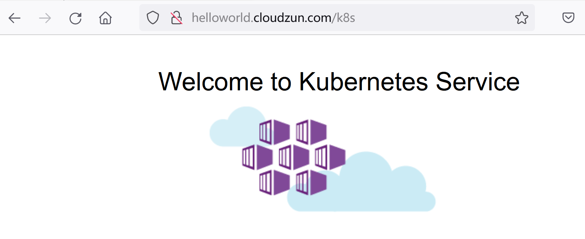
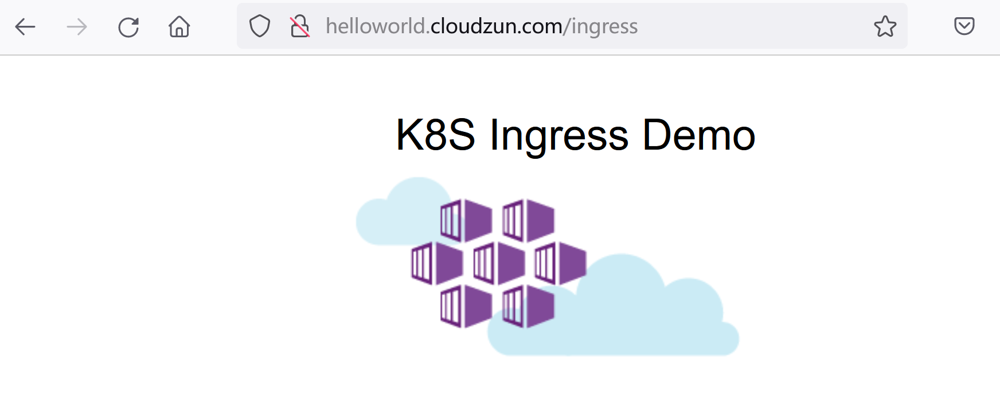
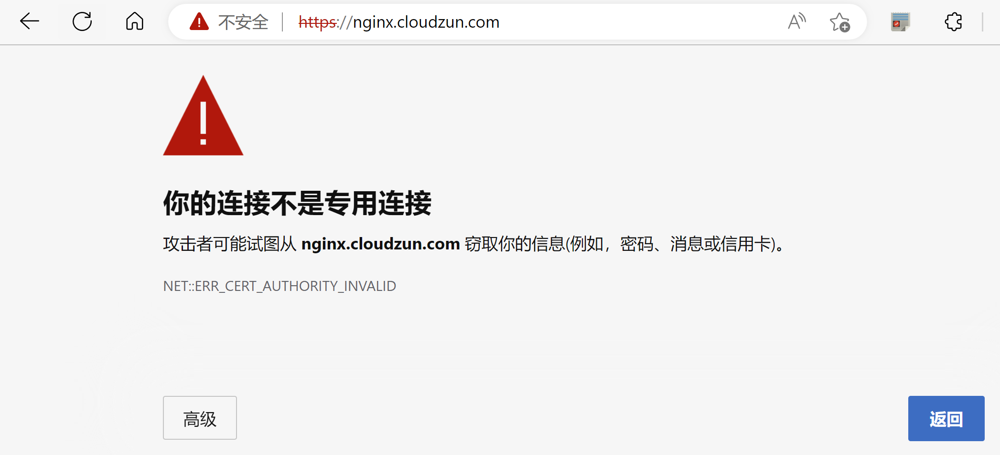
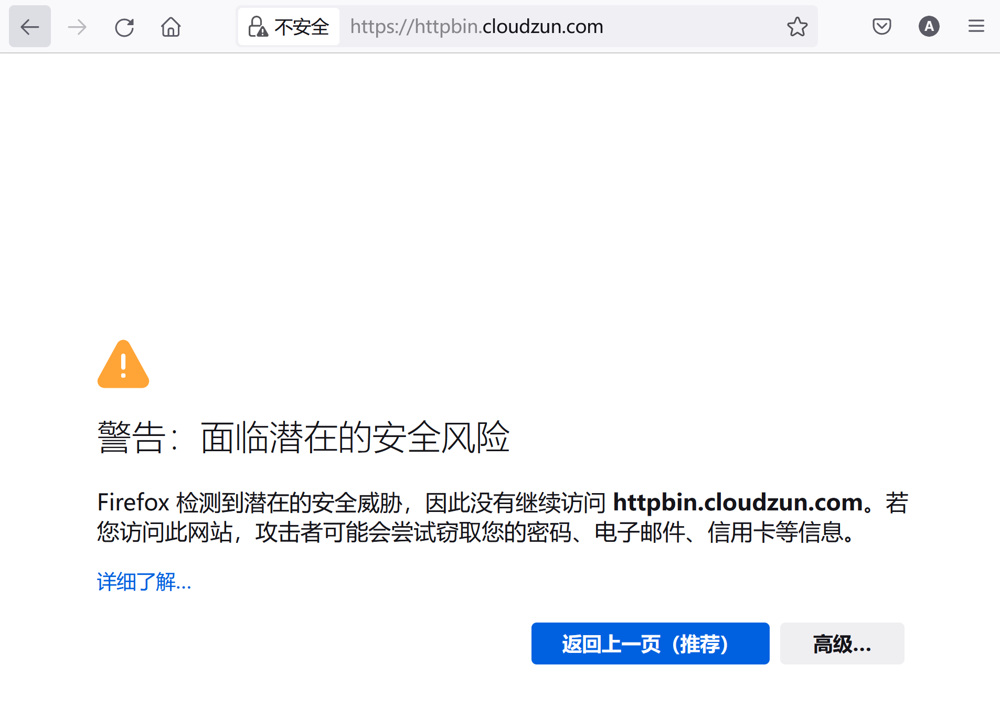
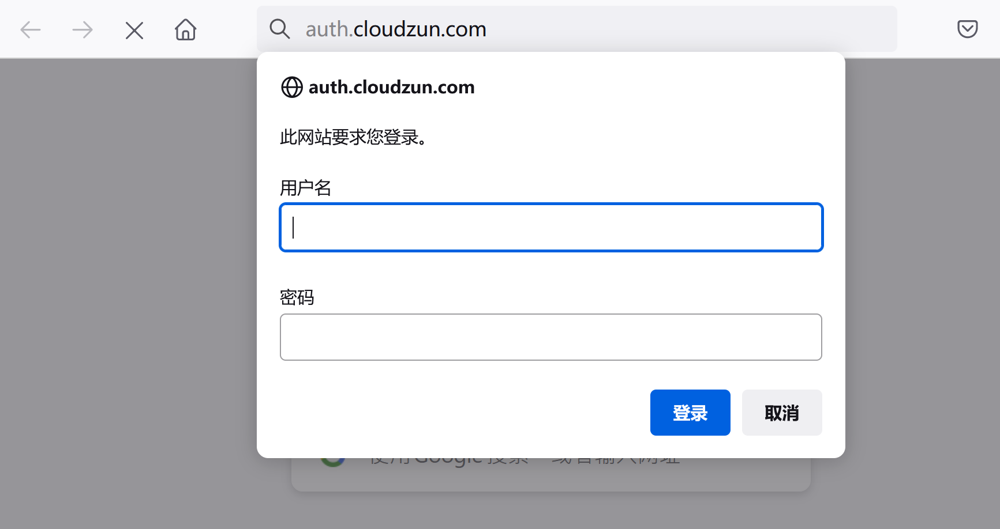
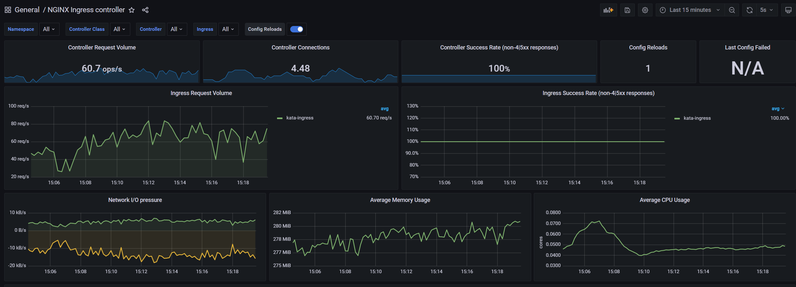

# 安装nginx-ingress-controller


下载helm项目

```bash
helm repo add ingress-nginx https://kubernetes.github.io/ingress-nginx
helm repo update
helm pull ingress-nginx/ingress-nginx 
```


编辑value.yaml

```bash
tar xf ingress-nginx-4.4.0.tgz
cd ingress-nginx/
nano values.yaml
```


修改映像位置（可选）

```yaml
controller:
  name: controller
  image:
    ## Keep false as default for now!
    chroot: false
    registry: registry.k8s.io # 替换成国内映像库，比如registry.cn-beijing.aliyuncs.com
    image: ingress-nginx/controller # 替换为映像目录，比如：cloudzun/controller
    ## for backwards compatibility consider setting the full image url via the repository value below
    ## use *either* current default registry/image or repository format or installing chart by providing the values.yaml will fail
    ## repository:
    tag: "v1.5.1"
    digest: sha256:4ba73c697770664c1e00e9f968de14e08f606ff961c76e5d7033a4a9c593c629 # 注释掉
    digestChroot: sha256:c1c091b88a6c936a83bd7b098662760a87868d12452529bad0d178fb36147345 #注释掉
    pullPolicy: IfNotPresent
    # www-data -> uid 101
    runAsUser: 101
    allowPrivilegeEscalation: true
```


hostNetwork设置为true

```yaml
 # -- Required for use with CNI based kubernetes installations (such as ones set up by kubeadm),
  # since CNI and hostport don't mix yet. Can be deprecated once https://github.com/kubernetes/kubernetes/issues/23920
  # is merged
  hostNetwork: true #修改为true
```


dnsPolicy设置为ClusterFirstWithHostNet

```yaml
  # -- Optionally change this to ClusterFirstWithHostNet in case you have 'hostNetwork: true'.
  # By default, while using host network, name resolution uses the host's DNS. If you wish nginx-controller
  # to keep resolving names inside the k8s network, use ClusterFirstWithHostNet.
  dnsPolicy: ClusterFirstWithHostNet #修改为ClusterFirstWithHostNet
```


NodeSelector添加ingress: "true"部署至指定节点

```yaml
  # -- Node labels for controller pod assignment
  ## Ref: https://kubernetes.io/docs/user-guide/node-selection/
  ##
  nodeSelector:
    kubernetes.io/os: linux
    ingress: "true" #此处增加一行
```


类型更改为kind: DaemonSet

```yaml
  # -- Use a `DaemonSet` or `Deployment`
  kind: DaemonSet # 选择DaemonSet
```


将Ingress Nginx设置为默认的ingressClass

```yaml
  ## This section refers to the creation of the IngressClass resource
  ## IngressClass resources are supported since k8s >= 1.18 and required since k8s >= 1.19
  ingressClassResource:
    # -- Name of the ingressClass
    name: nginx
    # -- Is this ingressClass enabled or not
    enabled: true
    # -- Is this the default ingressClass for the cluster
    default: true #设置为true
    # -- Controller-value of the controller that is processing this ingressClass
    controllerValue: "k8s.io/ingress-nginx"
```


给节点打标签,使其承载ingress-nginx-controller

```bash
kubectl label node node2 ingress=true
kubectl label node node3 ingress=true
```


安装ingress-nginx-controller

```bash
kubectl create ns ingress-nginx
helm install ingress-nginx -n ingress-nginx .
```


检查安装结果

```
kubectl get ingressclass -o wide
```

```bash
root@node1:~/ingress-nginx# kubectl get ingressclass -o wide
NAME    CONTROLLER             PARAMETERS   AGE
nginx   k8s.io/ingress-nginx   <none>       35m
```


```bash
kubectl get pod -n ingress-nginx -o wide
```

```bash
root@node1:~/ingress-nginx# kubectl get pod -n ingress-nginx -o wide
NAME                             READY   STATUS    RESTARTS   AGE   IP              NODE    NOMINATED NODE   READINESS GATES
ingress-nginx-controller-btszm   1/1     Running   0          64m   192.168.1.233   node3   <none>           <none>
ingress-nginx-controller-zchpt   1/1     Running   0          64m   192.168.1.232   node2   <none>           <none>
```


在某台承载ingress-nginx-controller的节点上检查通讯

```bash
netstat -lntp | grep 443
```

```bash
root@node2:~# netstat -lntp | grep 443
tcp        0      0 0.0.0.0:443             0.0.0.0:*               LISTEN      1063738/nginx: mast
tcp        0      0 0.0.0.0:443             0.0.0.0:*               LISTEN      1063738/nginx: mast
tcp        0      0 0.0.0.0:443             0.0.0.0:*               LISTEN      1063738/nginx: mast
tcp        0      0 0.0.0.0:443             0.0.0.0:*               LISTEN      1063738/nginx: mast
tcp6       0      0 :::8443                 :::*                    LISTEN      1063593/nginx-ingre
tcp6       0      0 :::443                  :::*                    LISTEN      1063738/nginx: mast
tcp6       0      0 :::443                  :::*                    LISTEN      1063738/nginx: mast
tcp6       0      0 :::443                  :::*                    LISTEN      1063738/nginx: mast
tcp6       0      0 :::443                  :::*                    LISTEN      1063738/nginx: mast
```


```bash
ps aux | grep nginx
```

```bash
root@node2:~# ps aux | grep nginx
systemd+ 1063573  0.0  0.0    204     4 ?        Ss   09:28   0:00 /usr/bin/dumb-init -- /nginx-ingress-controller --publish-service=ingress-nginx/ingress-nginx-controller --election-id=ingress-nginx-leader --controller-class=k8s.io/ingress-nginx --ingress-class=nginx --configmap=ingress-nginx/ingress-nginx-controller --validating-webhook=:8443 --validating-webhook-certificate=/usr/local/certificates/cert --validating-webhook-key=/usr/local/certificates/key
systemd+ 1063593  0.1  0.5 752476 44228 ?        Ssl  09:28   0:03 /nginx-ingress-controller --publish-service=ingress-nginx/ingress-nginx-controller --election-id=ingress-nginx-leader --controller-class=k8s.io/ingress-nginx --ingress-class=nginx --configmap=ingress-nginx/ingress-nginx-controller --validating-webhook=:8443 --validating-webhook-certificate=/usr/local/certificates/cert --validating-webhook-key=/usr/local/certificates/key
systemd+ 1063738  0.0  0.4 145176 36344 ?        S    09:28   0:00 nginx: master process /usr/bin/nginx -c /etc/nginx/nginx.conf
systemd+ 1063758  0.0  0.5 157300 41144 ?        Sl   09:28   0:00 nginx: worker process
systemd+ 1063760  0.0  0.5 157300 41004 ?        Sl   09:28   0:00 nginx: worker process
systemd+ 1063761  0.0  0.5 157300 40988 ?        Sl   09:28   0:00 nginx: worker process
systemd+ 1063762  0.0  0.5 157300 40988 ?        Sl   09:28   0:00 nginx: worker process
systemd+ 1063763  0.0  0.3 143120 29232 ?        S    09:28   0:00 nginx: cache manager process
root     1130900  0.0  0.0   8900   724 pts/0    S+   10:15   0:00 grep --color=auto nginx
```


极简安装方法（可选）

```bash
kubectl apply -f https://raw.githubusercontent.com/cloudzun/k8slab/v1.23/svc/ingress-nginx.yaml
```


# 基本发布


## Nginx Web

创建实例web服务

```bash
kubectl create ns study-ingress
kubectl create deploy nginx --image=nginx -n  study-ingress
kubectl expose deploy nginx --port 80 -n study-ingress
```


查看web服务实例细节

```bash
kubectl get pod -n study-ingress -o wide
kubectl get svc -n study-ingress -o wide
```

```bash
root@node1:~/ingress-nginx# kubectl get pod -n study-ingress -o wide
NAME                     READY   STATUS    RESTARTS   AGE     IP               NODE    NOMINATED NODE   READINESS GATES
nginx-85b98978db-x49zb   1/1     Running   0          2m45s   10.244.166.183   node1   <none>           <none>
root@node1:~/ingress-nginx# kubectl get svc -n study-ingress -o wide
NAME    TYPE        CLUSTER-IP       EXTERNAL-IP   PORT(S)   AGE     SELECTOR
nginx   ClusterIP   10.102.210.108   <none>        80/TCP    2m53s   app=nginx
```


尝试对服务进行访问

```bash
curl 10.102.210.108
```

```bash
root@node1:~# curl 10.102.210.108
<!DOCTYPE html>
<html>
<head>
<title>Welcome to nginx!</title>
<style>
html { color-scheme: light dark; }
body { width: 35em; margin: 0 auto;
font-family: Tahoma, Verdana, Arial, sans-serif; }
</style>
</head>
<body>
<h1>Welcome to nginx!</h1>
<p>If you see this page, the nginx web server is successfully installed and
working. Further configuration is required.</p>

<p>For online documentation and support please refer to
<a href="http://nginx.org/">nginx.org</a>.<br/>
Commercial support is available at
<a href="http://nginx.com/">nginx.com</a>.</p>

<p><em>Thank you for using nginx.</em></p>
</body>
</html
```


创建指向上述服务的ingress

```bash
nano web-ingress.yaml
```

```yaml
apiVersion: networking.k8s.io/v1
kind: Ingress
metadata:
  name: nginx-ingress
  namespace: study-ingress
spec:
  ingressClassName: nginx
  rules:
  - host: nginx.cloudzun.com
    http:
      paths:
      - backend:
          service:
            name: nginx
            port:
              number: 80
        path: /
        pathType: ImplementationSpecific
```


这是一个 Kubernetes 配置文件，定义了一个 Ingress 资源。Ingress 资源是 Kubernetes 集群中用于指导外部流量进入集群内部服务的一个对象。它允许您在一个公共 IP 地址下公开多个服务，并使用基于主机名或者 URL 的规则进行路由。

下面对这个配置文件的各个部分进行解释：

- `apiVersion`: 定义了要使用的 Kubernetes API 版本，这里是 `networking.k8s.io/v1`。
- `kind`: 定义了资源类型，这里是 `Ingress`。
- `metadata`: 定义了关于这个资源的一些基本信息。
    - `name`: 资源的名称，这里是 `nginx-ingress`。
    - `namespace`: 定义了这个资源所属的命名空间，这里是 `study-ingress`。
- `spec`: 定义了 Ingress 资源的详细规格。
    - `ingressClassName`: 指定了 Ingress 控制器类名称，这里是 `nginx`，代表这个 Ingress 应由 NGINX Ingress 控制器处理。
    - `rules`: 定义了 Ingress 资源的路由规则。
        - `host`: 指定达到 Ingress 的请求应该具有的主机名。在这个例子中，所有发送到 `nginx.cloudzun.com` 的请求将由此 Ingress 资源处理。
        - `http`: 定义了基于 HTTP 的路由规则。
            - `paths`: 列出了针对特定路径的 HTTP 路由规则。
                - `backend`: 指定处理请求的后端服务。
                    - `service`: 定义了后端服务的相关信息。
                        - `name`: 后端服务的名称，这里是 `nginx`。
                        - `port`: 后端服务的端口信息。
                            - `number`: 后端服务的端口号，这里是 `80`。
                - `path`: 对应的路径规则，这里是 `/`，表示将处理所有以 `/` 开头的请求路径。
                - `pathType`: 定义了 `path` 的解释方式。这里是 `ImplementationSpecific`，表示实现特定的，具体取决于 Ingress 控制器的处理规则。

总结一下，在这个 Kubernetes 配置文件中，一个名为 `nginx-ingress` 的 Ingress 资源被创建。此 Ingress 资源由 NGINX Ingress 控制器处理，对所有发送到主机名 `nginx.cloudzun.com` 的 HTTP 请求进行路由。所有请求以 `/` 开头的路径将被路由到名为 `nginx` 的后端服务，在此服务的端口 80 上处理这些请求。


```bash
kubectl create -f web-ingress.yaml
```


查看ingress

```bash
kubectl get ingress -n study-ingress
```

```bash
root@node1:~# kubectl get ingress -n study-ingress
NAME            CLASS   HOSTS                ADDRESS   PORTS   AGE
nginx-ingress   nginx   nginx.cloudzun.com             80      10m
```


检查ingress配置

```bash
kubectl get pod -n ingress-nginx
kubectl exec -it ingress-nginx-controller-btszm  -n ingress-nginx -- bash
ls 
grep  "nginx.cloudzun.com" nginx.conf
```

```bash
root@node1:~# kubectl exec -it ingress-nginx-controller-btszm  -n ingress-nginx -- bash
bash-5.1$ ls
fastcgi.conf            koi-utf                 modsecurity             owasp-modsecurity-crs   uwsgi_params.default
fastcgi.conf.default    koi-win                 modules                 scgi_params             win-utf
fastcgi_params          lua                     nginx.conf              scgi_params.default
fastcgi_params.default  mime.types              nginx.conf.default      template
geoip                   mime.types.default      opentracing.json        uwsgi_params
bash-5.1$ grep  "nginx.cloudzun.com" nginx.conf
        ## start server nginx.cloudzun.com
                server_name nginx.cloudzun.com ;
        ## end server nginx.cloudzun.com
```


亦可查看更多配置

```bash
bash-5.1$ more nginx.conf

# Configuration checksum: 2784066326814588111

# setup custom paths that do not require root access
pid /tmp/nginx/nginx.pid;

daemon off;

worker_processes 4;

worker_rlimit_nofile 1047552;

worker_shutdown_timeout 240s ;

events {
        multi_accept        on;
        worker_connections  16384;
        use                 epoll;

}

http {
        lua_package_path "/etc/nginx/lua/?.lua;;";

        lua_shared_dict balancer_ewma 10M;
        lua_shared_dict balancer_ewma_last_touched_at 10M;
        lua_shared_dict balancer_ewma_locks 1M;
        lua_shared_dict certificate_data 20M;
        lua_shared_dict certificate_servers 5M;
        lua_shared_dict configuration_data 20M;
        lua_shared_dict global_throttle_cache 10M;
        lua_shared_dict ocsp_response_cache 5M;

        init_by_lua_block {
                collectgarbage("collect")

                -- init modules
                local ok, res

--More-- (4% of 18301 bytes)
```

退出pod

```bash
exit
```

尝试在node1上进行访问

```bash
curl -H "Host:nginx.cloudzun.com" 192.168.1.232
```

```bash
root@node1:~# curl -H "Host:nginx.cloudzun.com" 192.168.1.232
<!DOCTYPE html>
<html>
<head>
<title>Welcome to nginx!</title>
<style>
html { color-scheme: light dark; }
body { width: 35em; margin: 0 auto;
font-family: Tahoma, Verdana, Arial, sans-serif; }
</style>
</head>
<body>
<h1>Welcome to nginx!</h1>
<p>If you see this page, the nginx web server is successfully installed and
working. Further configuration is required.</p>

<p>For online documentation and support please refer to
<a href="http://nginx.org/">nginx.org</a>.<br/>
Commercial support is available at
<a href="http://nginx.com/">nginx.com</a>.</p>

<p><em>Thank you for using nginx.</em></p>
</body>
</html>
```


修改host文件

```bash
cat >> /etc/hosts << EOF
192.168.1.232 nginx.cloudzun.com
192.168.1.233 nginx.cloudzun.com
EOF
```


尝试直接使用域名进行访问

```
curl nginx.cloudzun.com
```


```bash
root@node1~# curl nginx.cloudzun.com
<!DOCTYPE html>
<html>
<head>
<title>Welcome to nginx!</title>
<style>
html { color-scheme: light dark; }
body { width: 35em; margin: 0 auto;
font-family: Tahoma, Verdana, Arial, sans-serif; }
</style>
</head>
<body>
<h1>Welcome to nginx!</h1>
<p>If you see this page, the nginx web server is successfully installed and
working. Further configuration is required.</p>

<p>For online documentation and support please refer to
<a href="http://nginx.org/">nginx.org</a>.<br/>
Commercial support is available at
<a href="http://nginx.com/">nginx.com</a>.</p>

<p><em>Thank you for using nginx.</em></p>
</body>
</html>
```


尝试在宿主机上进行访问


## Katacoda Web


创建包含katacoda deployment svc和ingress的一体成型yaml文件

```bash
nano kata-ingress.yaml
```


```yaml
apiVersion: apps/v1
kind: Deployment
metadata:
  labels:
    app: katacoda
  name: katacoda
spec:
  replicas: 3
  selector:
    matchLabels:
      app: katacoda
  strategy: {}
  template:
    metadata:
      labels:
        app: katacoda
    spec:
      containers:
      - image: katacoda/docker-http-server
        name: docker-http-server
        resources: {}
---
apiVersion: v1
kind: Service
metadata:
  labels:
    app: katacoda
  name: katacoda
spec:
  ports:
  - name: 80-80
    port: 80
    protocol: TCP
    targetPort: 80
  selector:
    app: katacoda
  type: ClusterIP
---
apiVersion: networking.k8s.io/v1
kind: Ingress
metadata:
  name: kata-ingress
spec:
  ingressClassName: nginx
  rules:
  - host: kata.cloudzun.com
    http:
      paths:
      - backend:
          service:
            name: katacoda
            port:
              number: 80
        path: /
        pathType: ImplementationSpecific
```

这个 Ingress 资源定义了一个名为 `kata-ingress` 的入口对象，用于将外部访问流量路由到 Kubernetes 集群内部。它选择名为 `nginx` 的 Ingress 类（由 `spec.ingressClassName` 定义），这意味着使用 NGINX Ingress 控制器处理此 Ingress。对于指向 `kata.cloudzun.com` 的请求，Ingress 会根据定义的 HTTP 路径规则将流量路由到名为 `katacoda` 的服务上的 80 端口。

```bash
kubectl apply -f kata-ingress.yaml
```


查看ingress

```bash
kubectl describe ingress kata-ingress
```

```bash
root@node1:~# kubectl describe ingress kata-ingress
Name:             kata-ingress
Labels:           <none>
Namespace:        default
Address:
Default backend:  default-http-backend:80 (<error: endpoints "default-http-backend" not found>)
Rules:
  Host               Path  Backends
  ----               ----  --------
  kata.cloudzun.com
                     /   katacoda:80 (10.244.104.62:80,10.244.135.24:80,10.244.166.185:80)
Annotations:         <none>
Events:
  Type    Reason  Age    From                      Message
  ----    ------  ----   ----                      -------
  Normal  Sync    3m19s  nginx-ingress-controller  Scheduled for sync
  Normal  Sync    3m19s  nginx-ingress-controller  Scheduled for sync
```


编辑host

```bash
cat >> /etc/hosts << EOF
192.168.1.232 kata.cloudzun.com
192.168.1.233 kata.cloudzun.com
EOF
```


本地访问

```bash
curl kata.cloudzun.com
```

```bash
root@node1:~# curl kata.cloudzun.com
<h1>This request was processed by host: katacoda-56dbd65b59-wr448</h1>
root@node1:~# curl kata.cloudzun.com
<h1>This request was processed by host: katacoda-56dbd65b59-tmgpd</h1>
root@node1:~# curl kata.cloudzun.com
<h1>This request was processed by host: katacoda-56dbd65b59-rm7cz</h1>
```


# 域名重定向


创建yaml文件

```bash
nano redirect.yaml
```

```yaml
apiVersion: networking.k8s.io/v1
kind: Ingress
metadata:
  annotations:
    nginx.ingress.kubernetes.io/permanent-redirect: https://www.cloudzun.com
    nginx.ingress.kubernetes.io/permanent-redirect-code: '308'
  name: nginx-redirect
  namespace: study-ingress
spec:
  ingressClassName: nginx
  rules:
  - host: nginx.redirect.com
    http:
      paths:
      - backend:
          service:
            name: nginx
            port:
              number: 80
        path: /
        pathType: ImplementationSpecific
```

这是一个Kubernetes Ingress配置文件，用于定义如何管理针对特定主机名（host）的HTTP请求。这里的Ingress对象是为了在用户访问指定主机名时，实现永久重定向到另一个网址。

- `apiVersion`: 表示使用的Kubernetes API组和版本。在这里，版本是`networking.k8s.io/v1`。

- `kind`: 表示资源类型。本例中为`Ingress`。

- `metadata`: 为Ingress对象定义元数据。
  - `annotations`: 定义了一些额外的配置信息，主要是用于nginx ingress控制器。
    - `nginx.ingress.kubernetes.io/permanent-redirect`: 表示启用永久重定向，将所有匹配到的请求重定向到`https://www.cloudzun.com`。
    - `nginx.ingress.kubernetes.io/permanent-redirect-code`: 表示使用HTTP状态代码`308`作为重定向状态。
  - `name`: Ingress对象的名称，这里为`nginx-redirect`。
  - `namespace`: Ingress对象所在的命名空间，这里为`study-ingress`。

- `spec`: 定义Ingress的规格。
  - `ingressClassName`: 指定使用的Ingress类。本例中为`nginx`，表示使用`nginx` Ingress控制器处理Ingress对象。
  - `rules`: 定义Ingress对象的规则。
    - `host`: 要匹配的主机名，这里为`nginx.redirect.com`。

      `http`部分包含一个`path`定义：
      - `path`: 路径匹配模式，这里为`/`，表示匹配所有请求路径。
      - `pathType`: 路径匹配的类型，这里为`ImplementationSpecific`，表示不识别的实现行为由Ingress类确定。
      - `backend.service`: 定义后端服务，本例中使用一个名为`nginx`的服务，监听`80`端口。

综上，此Kubernetes Ingress配置用于将访问`nginx.redirect.com`的所有HTTP请求永久重定向（HTTP状态代码为308）到`https://www.cloudzun.com`。

```bash
kubectl apply -f redirect.yaml
```


查看ingress

```bash
kubectl describe ingress nginx-redirect  -n study-ingress
```

```bash
root@node1:~# kubectl describe ingress nginx-redirect  -n study-ingress
Name:             nginx-redirect
Labels:           <none>
Namespace:        study-ingress
Address:
Default backend:  default-http-backend:80 (<error: endpoints "default-http-backend" not found>)
Rules:
  Host                Path  Backends
  ----                ----  --------
  nginx.redirect.com
                      /   nginx:80 (10.244.166.183:80)
Annotations:          nginx.ingress.kubernetes.io/permanent-redirect: https://www.cloudzun.com
                      nginx.ingress.kubernetes.io/permanent-redirect-code: 308
Events:
  Type    Reason  Age   From                      Message
  ----    ------  ----  ----                      -------
  Normal  Sync    82s   nginx-ingress-controller  Scheduled for sync
  Normal  Sync    82s   nginx-ingress-controller  Scheduled for sync
```


更新hosts

```
cat >> /etc/hosts << EOF
192.168.1.232 nginx.redirect.com
192.168.1.233 nginx.redirect.com
EOF
```


尝试从node上进行测试

```bash
curl -I nginx.redirect.com
```

```bash
root@node1:~# curl nginx.redirect.com
<html>
<head><title>308 Permanent Redirect</title></head>
<body>
<center><h1>308 Permanent Redirect</h1></center>
<hr><center>nginx</center>
</body>
</html>
root@node1:~# curl -I nginx.redirect.com
HTTP/1.1 308 Permanent Redirect
Date: Tue, 22 Nov 2022 05:47:31 GMT
Content-Type: text/html
Content-Length: 164
Connection: keep-alive
Location: https://www.cloudzun.com
```


# 前后端分离

Backend-API

创建测试用资源

```bash
kubectl create deploy backend-api --image=registry.cn-beijing.aliyuncs.com/dotbalo/nginx:backend-api -n  study-ingress
kubectl expose deploy backend-api --port 80 -n study-ingress
```


查看服务

```
kubectl get svc -n study-ingress
```

```bash
root@node1:~# kubectl get svc -n study-ingress
NAME          TYPE        CLUSTER-IP       EXTERNAL-IP   PORT(S)   AGE
backend-api   ClusterIP   10.103.40.118    <none>        80/TCP    18m
nginx         ClusterIP   10.102.210.108   <none>        80/TCP    3h44m
```


访问服务

```bash
 curl  10.103.40.118
```

```bash
root@node1:~# curl  10.103.40.118
<h1> backend for ingress rewrite </h1>

<h2> Path: /api-a </h2>


<a href="http://gaoxin.kubeasy.com"> Kubeasy </a>

```


创建rewrite策略

```
nano rewrite.yaml
```

```yaml
apiVersion: networking.k8s.io/v1
kind: Ingress
metadata:
  annotations:
    nginx.ingress.kubernetes.io/rewrite-target: /$2
  name: backend-api
  namespace: study-ingress
spec:
  ingressClassName: nginx
  rules:
  - host: nginx.cloudzun.com
    http:
      paths:
      - backend:
          service:
            name: backend-api
            port:
              number: 80
        path: /api-a(/|$)(.*)
        pathType: ImplementationSpecific
```

这是一个Kubernetes Ingress资源的YAML配置文件，用于定义如何在Kubernetes集群中处理进入服务的请求。我们将逐一解释配置中的各个部分：

1. `apiVersion: networking.k8s.io/v1`：指定Kubernetes Ingress对象使用的API版本为`networking.k8s.io/v1`。

2. `kind: Ingress`：指定资源类型为Ingress。

3. `metadata`：提供有关Ingress对象的元数据，如注解、名称等。
    a. `annotations: nginx.ingress.kubernetes.io/rewrite-target: /$2`：声明了Ingress注解（annotations），其中`nginx.ingress.kubernetes.io/rewrite-target: /$2`表示使用Nginx作为Ingress控制器时，将重写的URL路径（Path）设置为匹配正则表达式中第二个子表达式（捕捉括号内路径）。
    b. `name: backend-api`：为Ingress定义的名称为`backend-api`。
    c. `namespace: study-ingress`：将Ingress对象部署到名为`study-ingress`的命名空间。

4. `spec`：Ingress规范详细内容。
    a. `ingressClassName: nginx`：指定该Ingress资源使用名为"nginx"的Ingress类。
    b. `rules`：定义了如何匹配到达Ingress的请求，以及将它们转发到哪个后端服务。
        i. `- host: nginx.cloudzun.com`：只有在主机为`nginx.cloudzun.com`的HTTP请求才会经由规则处理。
        ii. `http:`：定义HTTP规则。
            1. `paths`：定义了具体的路径和与之对应的后端服务。
                a. `- backend:`：定义与路径匹配的后端服务。
                    i. `service:`：指定后端服务。
                        1. `name: backend-api`：后端服务的名称为`backend-api`。
                        2. `port: number: 80`：后端服务监听的端口号为80。
                b. `path: /api-a(/|$)(.*)`：定义一个匹配规则，仅当路径符合该规则时才转发请求到后端服务。这里使用正则表达式，捕获以`/api-a/`或`/api-a`开头的路径，并携带任意字符。
                c. `pathType: ImplementationSpecific`：指定路径类型为`ImplementationSpecific`，这意味着具体路径匹配策略将取决于Ingress控制器（在此例子中是Nginx Ingress控制器）。

总结：这个Ingress配置文件定义了名称为`backend-api`的Ingress对象，位于`study-ingress`命名空间内，并使用`nginx` Ingress类。当收到主机名为`nginx.cloudzun.com`的HTTP请求时，这个配置会将以`/api-a/`或`/api-a`开头的路径重写，并将其映射到名称为`backend-api`、端口为80的后端服务。

```bash
kubectl apply -f rewrite.yaml
```


查看ingress

```bash
kubectl get ingress -n study-ingress
```

```bash
root@node1:~# kubectl get ingress -n study-ingress
NAME             CLASS   HOSTS                ADDRESS   PORTS   AGE
backend-api      nginx   nginx.cloudzun.com             80      5m4s
nginx-ingress    nginx   nginx.cloudzun.com             80      3h38m
nginx-redirect   nginx   nginx.redirect.com             80      46m
```


尝试验证rewrite效果

```bash
 curl http://nginx.cloudzun.com/api-a
```

```bash
root@node1:~# curl http://nginx.cloudzun.com/api-a
<h1> backend for ingress rewrite </h1>

<h2> Path: /api-a </h2>


<a href="http://gaoxin.kubeasy.com"> Kubeasy </a>
```


# 多路径发布


创建命名空间

```bash
kubectl create ns ingress-basic
```


创建工作负载

```bash
nano aks-helloworld-one.yaml
```

```yaml
apiVersion: apps/v1
kind: Deployment
metadata:
  name: aks-helloworld-one  
spec:
  replicas: 1
  selector:
    matchLabels:
      app: aks-helloworld-one
  template:
    metadata:
      labels:
        app: aks-helloworld-one
    spec:
      containers:
      - name: aks-helloworld-one
        image: mcr.microsoft.com/azuredocs/aks-helloworld:v1
        ports:
        - containerPort: 80
        env:
        - name: TITLE
          value: "Welcome to Kubernetes Service"
---
apiVersion: v1
kind: Service
metadata:
  name: aks-helloworld-one  
spec:
  type: ClusterIP
  ports:
  - port: 80
  selector:
    app: aks-helloworld-one
```

```bash
nano aks-helloworld-two.yaml
```

```yaml
apiVersion: apps/v1
kind: Deployment
metadata:
  name: aks-helloworld-two  
spec:
  replicas: 1
  selector:
    matchLabels:
      app: aks-helloworld-two
  template:
    metadata:
      labels:
        app: aks-helloworld-two
    spec:
      containers:
      - name: aks-helloworld-two
        image: mcr.microsoft.com/azuredocs/aks-helloworld:v1
        ports:
        - containerPort: 80
        env:
        - name: TITLE
          value: "K8S Ingress Demo"
---
apiVersion: v1
kind: Service
metadata:
  name: aks-helloworld-two  
spec:
  type: ClusterIP
  ports:
  - port: 80
  selector:
    app: aks-helloworld-two  
```

```bash
kubectl apply -f aks-helloworld-one.yaml --namespace ingress-basic
kubectl apply -f aks-helloworld-two.yaml --namespace ingress-basic
```


查看样例部署结果

```bash
kubectl get pod -n ingress-basic -o wide
```

```bash
kubectl get svc -n ingress-basic -o wide
```

```bash
root@node1:~# kubectl get pod -n ingress-basic -o wide
NAME                                  READY   STATUS    RESTARTS   AGE     IP              NODE    NOMINATED NODE   READINESS GATES
aks-helloworld-one-78c54cdb65-hxnn7   1/1     Running   0          8m13s   10.244.135.13   node3   <none>           <none>
aks-helloworld-two-6658d485f5-rgnws   1/1     Running   0          8m10s   10.244.135.15   node3   <none>           <none>
root@node1:~# kubectl get svc -n ingress-basic -o wide
NAME                 TYPE        CLUSTER-IP       EXTERNAL-IP   PORT(S)   AGE   SELECTOR
aks-helloworld-one   ClusterIP   10.96.127.118    <none>        80/TCP    64m   app=aks-helloworld-one
aks-helloworld-two   ClusterIP   10.107.242.113   <none>        80/TCP    64m   app=aks-helloworld-two
```


创建多路径发布的配置文件

```bash
nano aks-ingress.yaml
```

```yaml
apiVersion: networking.k8s.io/v1
kind: Ingress
metadata:
  name: hello-world-ingress
  namespace: ingress-basic
  annotations:
    nginx.ingress.kubernetes.io/rewrite-target: /$1
spec:
  ingressClassName: nginx
  rules:
  - host: helloworld.cloudzun.com
    http:
      paths:
      - backend:
          service:
            name: aks-helloworld-one
            port:
              number: 80
        path: /k8s(/|$)(.*)
        pathType: ImplementationSpecific
      - backend:
          service:
            name: aks-helloworld-two
            port:
              number: 80
        path: /ingress(/|$)(.*)
        pathType: ImplementationSpecific
      - backend:
          service:
            name: aks-helloworld-one
            port:
              number: 80
        path: /(.*)
        pathType: ImplementationSpecific
```

这是一个 Kubernetes Ingress 资源的配置文件。Ingress 主要用于管理集群内部服务的外部访问。

1. `apiVersion`: 使用的 API 版本是 "networking.k8s.io/v1"。
2. `kind`: 资源类型是 "Ingress"。
3. `metadata`: Ingress 的元数据信息。
   * `name`: Ingress 资源的名称是 "hello-world-ingress"。
   * `namespace`: Ingress 资源所属的命名空间是 "ingress-basic"。
   * `annotations`: 注解用于额外配置 Ingress 控制器（如 nginx）的行为。
      * `nginx.ingress.kubernetes.io/rewrite-target`: 该注解表示 URL 重写的目标，使用 `/$1` 替换与正则表达式 `(/|$)(.*)` 匹配的部分。
4. `spec`: Ingress 规格定义。
   * `ingressClassName`: Ingress 使用 "nginx" 类。这决定了 Ingress 对象由哪个 Ingress 控制器处理。
   * `rules`: 定义访问规则。
      - 第一个规则：
         * `host`: 对于请求来自 "helloworld.cloudzun.com" 的主机名。
         * `http`:
           * `paths`: 定义多个路径。
              1. 当路径匹配 "/k8s(/|$)(.*)" 时，将请求路由到名为 "aks-helloworld-one" 的服务，服务端口为 80。
              2. 当路径匹配 "/ingress(/|$)(.*)" 时，将请求路由到名为 "aks-helloworld-two" 的服务，服务端口为 80。
              3. 当路径匹配 "/(.*)" 时，将请求路由到名为 "aks-helloworld-one" 的服务，服务端口为 80。
         * `pathType`: 路径匹配类型设置为 "ImplementationSpecific"，表示使用实现特定的匹配规则，即由 Ingress 控制器决定匹配规则。

总结起来，该 Ingress 配置为名为 "aks-helloworld-one" 和 "aks-helloworld-two" 的两个服务提供了通过指定域名和相应路径的外部访问。同时，使用这个配置将自动重写 URL，以便正确地将请求路由到目标服务。

```
kubectl apply -f aks-ingress.yaml
```


查看ingress配置

```bash
kubectl describe ingress hello-world-ingress  -n ingress-basic
```

```bash
root@node1:~#  kubectl describe ingress hello-world-ingress  -n ingress-basic
Name:             hello-world-ingress
Labels:           <none>
Namespace:        ingress-basic
Address:
Default backend:  default-http-backend:80 (<error: endpoints "default-http-backend" not found>)
Rules:
  Host                     Path  Backends
  ----                     ----  --------
  helloworld.cloudzun.com
                           /k8s(/|$)(.*)       aks-helloworld-one:80 (10.244.135.13:80)
                           /ingress(/|$)(.*)   aks-helloworld-two:80 (10.244.135.15:80)
                           /(.*)               aks-helloworld-one:80 (10.244.135.13:80)
Annotations:               nginx.ingress.kubernetes.io/rewrite-target: /$1
Events:
  Type    Reason  Age                From                      Message
  ----    ------  ----               ----                      -------
  Normal  Sync    14s (x3 over 33m)  nginx-ingress-controller  Scheduled for sync
  Normal  Sync    14s (x3 over 33m)  nginx-ingress-controller  Scheduled for sync
```


更新hosts

```bash
cat >> /etc/hosts << EOF
192.168.1.232 helloworld.cloudzun.com
192.168.1.233 helloworld.cloudzun.com
EOF
```


浏览器测试








# 启用SSL

## 自签名证书

创建证书和secret

```bash
openssl req -x509 -nodes -days 365 -newkey rsa:2048 -keyout tls.key -out tls.crt -subj "/CN=nginx.cloudzun.com"

kubectl create secret tls ca-secret --key tls.key --cert tls.crt -n study-ingress
```

```bash
root@node1:~# openssl req -x509 -nodes -days 365 -newkey rsa:2048 -keyout tls.key -out tls.crt -subj "/CN=nginx.cloudzun.com"
Generating a RSA private key
..........................................................................................................................................................+++++
......................................................................+++++
writing new private key to 'tls.key'
-----
root@node1:~# kubectl create secret tls ca-secret --key tls.key --cert tls.crt -n study-ingress
secret/ca-secret created

```


查看secret细节

```bash
kubectl describe secret ca-secret  -n study-ingress
```


```bash
root@node1:~# kubectl describe secret ca-secret  -n study-ingress
Name:         ca-secret
Namespace:    study-ingress
Labels:       <none>
Annotations:  <none>

Type:  kubernetes.io/tls

Data
====
tls.crt:  1139 bytes
tls.key:  1704 bytes
```


编辑配置文件并为nginx.cloudzun.com 启用SSL

```bash
nano ingress-ssl.yaml
```

```yaml
apiVersion: networking.k8s.io/v1
kind: Ingress
metadata:
  namespace: study-ingress
  name: nginx-ingress
spec:
  ingressClassName: nginx
  rules:
  - host: nginx.cloudzun.com
    http:
      paths:
      - backend:
          service:
            name: nginx
            port:
              number: 80
        path: /
        pathType: ImplementationSpecific
  tls:
  - hosts:
    - nginx.test.com
    secretName: ca-secret
```

这是一个Kubernetes Ingress资源的YAML配置文件。Ingress用于管理集群内服务的外部访问。这个特定的Ingress资源有以下配置:

1. `apiVersion`: 使用的API版本为`networking.k8s.io/v1`，这是Ingress资源的一个较新的API版本。
2. `kind`: 资源类型为`Ingress`。
3. `metadata`: 元数据包含了Ingress资源的名称和命名空间：
   - `namespace`: Ingress资源位于`study-ingress`命名空间。
   - `name`: Ingress资源的名称为`nginx-ingress`。
4. `spec`: Ingress规范包含了Ingress资源的配置信息：
   - `ingressClassName`: 使用`nginx`作为Ingress类名，这将导致Ingress资源被关联的Ingress控制器（如nginx-ingress-controller）处理。
   - `rules`: 定义了如何路由外部请求到集群内的服务：
     - 访问该Ingress的规则用于匹配主机名`nginx.cloudzun.com`。这意味着所有发送到该域名的HTTP请求将由此Ingress资源处理。
     - `http`部分定义了路径和相关服务的映射规则：
       - 当访问的路径为`/`时（`path`字段），将流量路由到名为`nginx`的服务的80端口（`name`和`number`字段）。
       - `pathType`为`ImplementationSpecific`，这表示对于这个实现，不同的Ingress控制器可能对路径进行不同的匹配。
   - `tls`: 配置了与TLS相关的设置，用于安全传输：
     -`hosts`: 列出了一个主机名 `nginx.test.com` 的 TLS 配置。
     -`secretName`: 指定了一个名为 `ca-secret` 的 Kubernetes Secret，用于存储 TLS 证书和私钥。

总之，这个Ingress资源配置了基于nginx的Ingress控制器，将针对`nginx.cloudzun.com`域名的HTTP请求路由到集群内部名为`nginx`的服务的80端口，同时配置TLS连接以支持`nginx.test.com`域名。

```bash
kubectl apply -f ingress-ssl.yaml
```


尝试在node上进行访问

```bash
curl http://nginx.cloudzun.com -I
```

```bash
root@node1:~# curl http://nginx.cloudzun.com -I
HTTP/1.1 308 Permanent Redirect
Date: Tue, 22 Nov 2022 07:53:13 GMT
Content-Type: text/html
Content-Length: 164
Connection: keep-alive
Location: https://nginx.cloudzun.com
```


浏览器访问效果




## 集成cert-manager

安装cert-manager

```bash
kubectl apply -f https://github.com/cert-manager/cert-manager/releases/download/v1.10.1/cert-manager.yaml
```


查看安装结果

```bash
kubectl get pod -n cert-manager
```

```bash
root@node1:~# kubectl get pod -n cert-manager
NAME                                       READY   STATUS    RESTARTS   AGE
cert-manager-b4b465456-6fxnt               1/1     Running   0          3h54m
cert-manager-cainjector-64d74f9c8f-z6fks   1/1     Running   0          3h54m
cert-manager-webhook-66fff58cdf-r76z9      1/1     Running   0          3h54m
```


创建clusterissuer

```bash
nano cluster-issuer.yaml
```

```yaml
apiVersion: cert-manager.io/v1
kind: ClusterIssuer
metadata:
  name: selfsigned-cluster-issuer
spec:
  selfSigned: {}
```

```bash
kubectl apply -f cluster-issuer.yaml
```


查看clusterissuer

```bash
kubectl get clusterissuer
```

```bash
root@node1:~# kubectl get clusterissuer
NAME                        READY   AGE
selfsigned-cluster-issuer   True    41m
```


创建httpbin服务

```yaml
nano httpbin-ingress.yaml
```

```yaml
apiVersion: v1
kind: ServiceAccount
metadata:
  name: httpbin
---
apiVersion: v1
kind: Service
metadata:
  name: httpbin
  labels:
    app: httpbin
    service: httpbin
spec:
  ports:
  - name: http
    port: 8000
    targetPort: 80
  selector:
    app: httpbin
---
apiVersion: apps/v1
kind: Deployment
metadata:
  name: httpbin
spec:
  replicas: 1
  selector:
    matchLabels:
      app: httpbin
      version: v1
  template:
    metadata:
      labels:
        app: httpbin
        version: v1
    spec:
      serviceAccountName: httpbin
      containers:
      - image: docker.io/kennethreitz/httpbin
        imagePullPolicy: IfNotPresent
        name: httpbin
        ports:
        - containerPort: 80
---
apiVersion: networking.k8s.io/v1
kind: Ingress
metadata:
  name: httpbin-ingress
  annotations:
    # kubernetes.io/ingress.class: ingress
    cert-manager.io/cluster-issuer: selfsigned-cluster-issuer
spec:
  ingressClassName: nginx
  rules:
  - host: httpbin.cloudzun.com
    http:
      paths:
      - backend:
          service:
            name: httpbin
            port:
              number: 8000
        path: /
        pathType: ImplementationSpecific
  tls:
    - hosts:
      - kata.cloudzun.com 
      secretName: httpbin-tls
```


这是一个Kubernetes Ingress资源的YAML配置，用于设置Ingress规则，将基于Nginx的Ingress控制器用于路由请求。以下是配置文件的详细解释：

1. `apiVersion: networking.k8s.io/v1`：表示使用的Kubernetes API版本是`networking.k8s.io/v1`。

2. `kind: Ingress`：表示这是一个Ingress资源。

3. `metadata`部分包含了以下信息：
   - `name: httpbin-ingress`：表示Ingress资源的名称是`httpbin-ingress`。
   - `annotations`子部分包括：
        - `cert-manager.io/cluster-issuer: selfsigned-cluster-issuer`：在工作负载中配置cert-manager，使用self-signed类型的ClusterIssuer来颁发TLS证书。

4. `spec`部分包含了设置Ingress的详细规范：

   - `ingressClassName: nginx`：指定使用名为“nginx”的IngressClass。这意味着将使用基于Nginx的Ingress控制器。
   - `rules`子部分定义了如何路由请求：
      - `- host: httpbin.cloudzun.com`：针对`httpbin.cloudzun.com`域名的请求。
         - `http`子部分定义了HTTP路径的路由规则：
            - `- backend`：定义了后端服务。
                - `service`：定义了后端服务。
                   - `name: httpbin`：后端服务的名称为`httpbin`。
                   - `port`：配置后端服务的端口。
                      - `number: 8000`：后端服务的端口号为8000。
            - `path: /`：捕获所有路径。
            - `pathType: ImplementationSpecific`：设置路径类型为ImplemenationSpecific，意味着路径类型可能由Ingress提供商进行特殊处理，具体取决于Ingress实现。

   - `tls`子部分用于配置TLS，包括：
      - `- hosts`：指定使用TLS的域名。
         - `- kata.cloudzun.com`：适用于域名`kata.cloudzun.com`的TLS连接。
      - `secretName: httpbin-tls`：指定用于证书和私钥的Kubernetes Secret资源名称为`httpbin-tls`。

综上所述，此配置将针对`httpbin.cloudzun.com`域名的HTTP请求路由到集群内部名为`httpbin`的服务的8000端口，并支持TLS连接，使用名为`httpbin-tls`的Kubernetes Secret存储TLS证书和私钥。使用cert-manager自签名的方式颁发和管理TLS证书。


```
kubectl apply -f httpbin-ingress.yaml
```


查看证书申请

```bash
kubectl get certificaterequest
```

```bash
root@node1:~# kubectl get certificaterequest
NAME                APPROVED   DENIED   READY   ISSUER                      REQUESTOR                                         AGE
httpbin-tls-6qhlx   True                True    selfsigned-cluster-issuer   system:serviceaccount:cert-manager:cert-manager   33m
```


查看证书

```bash
kubectl get certificate
```

```bash
root@node1:~# kubectl get certificate
NAME          READY   SECRET        AGE
httpbin-tls   True    httpbin-tls   28m
```


查看secret

```
 kubectl describe  secret httpbin-tls
```

```bash
root@node1:~# kubectl get secret
NAME                  TYPE                                  DATA   AGE
httpbin-tls           kubernetes.io/tls                     3      36m
root@node1:~# kubectl describe  secret httpbin-tls
Name:         httpbin-tls
Namespace:    default
Labels:       <none>
Annotations:  cert-manager.io/alt-names: kata.cloudzun.com
              cert-manager.io/certificate-name: httpbin-tls
              cert-manager.io/common-name:
              cert-manager.io/ip-sans:
              cert-manager.io/issuer-group: cert-manager.io
              cert-manager.io/issuer-kind: ClusterIssuer
              cert-manager.io/issuer-name: selfsigned-cluster-issuer
              cert-manager.io/uri-sans:

Type:  kubernetes.io/tls

Data
====
tls.crt:  1029 bytes
tls.key:  1675 bytes
ca.crt:   1029 bytes
```


更新hosts

```bash
cat >> /etc/hosts << EOF
192.168.1.232 httpbin.cloudzun.com
192.168.1.233 httpbin.cloudzun.com
EOF
```


尝试在node上进行访问

```bash
root@node1:~# curl httpbin.cloudzun.com
<html>
<head><title>308 Permanent Redirect</title></head>
<body>
<center><h1>308 Permanent Redirect</h1></center>
<hr><center>nginx</center>
</body>
</html>
root@node1:~# curl httpbin.cloudzun.com -I
HTTP/1.1 308 Permanent Redirect
Date: Thu, 24 Nov 2022 10:42:23 GMT
Content-Type: text/html
Content-Length: 164
Connection: keep-alive
Location: https://httpbin.cloudzun.com
```


尝试在浏览器上访问




## cert-manager的ACME使用场景（可选：需要互联网直连环境）


使用以下范例，创建certificate-issuer

```
nano certificate-issuer-prod.yaml
```

```yaml
apiVersion: cert-manager.io/v1
kind: Issuer
metadata:
  name: letsencrypt-prod
spec:
  acme:
    server: https://acme-v02.api.letsencrypt.org/directory
    email: info@cloudzun.com
    privateKeySecretRef:
      name: letsencrypt-prod
    solvers:
    - http01:
        ingress:
          class: nginx
```

这是一个 Kubernetes 配置文件，用于创建 cert-manager 的一个 "Issuer" 资源。Issuer 是 cert-manager 中的核心组件，负责管理和颁发 TLS 证书。这个配置创建了一个名为 "letsencrypt-prod" 的 Issuer，并配置使用 Let's Encrypt ACME 服务器进行证书自动颁发。

下面是这个配置文件的逐行解释：

- `apiVersion: cert-manager.io/v1`：使用 cert-manager.io API 版本 v1。
- `kind: Issuer`：定义资源类型为 "Issuer"。
- `metadata:`：资源的元数据部分。
  - `name: letsencrypt-prod`：Issuer 资源的名字为 "letsencrypt-prod"。
- `spec:`：Issuer 的详细配置。
  - `acme:`：使用 ACME 协议作为证书颁发机制（通常用于向 Let's Encrypt 请求证书）。
    - `server: https://acme-v02.api.letsencrypt.org/directory`：设置 ACME 服务器的地址，指向 Let's Encrypt 的生产环境服务器。
    - `email: info@cloudzun.com`：用于颁发证书过程中联系的人的邮箱地址。
    - `privateKeySecretRef:`：ACME 协议所需的私钥引用配置。
      - `name: letsencrypt-prod`：私钥将被保存在名为 "letsencrypt-prod" 的 Kubernetes Secret 资源中。
    - `solvers:`：配置证书颁发的解决方案（证明域名所有权的方法）。
      - `- http01:`：使用 HTTP-01 验证方法来证明对域名的所有权。
        - `ingress:`：指定要使用的 Ingress。
          - `class: nginx`：使用 nginx 类型的 Ingress 控制器。

总之，这个文件创建了一个名为 "letsencrypt-prod" 的 Issuer，同时使用 Let's Encrypt 的 ACME 服务器颁发证书，采用 HTTP-01 验证方法，证书联系人邮箱为 info@cloudzun.com，私钥被保存在名为 "letsencrypt-prod" 的 Secret 中。此外，Issuer 配置为使用 nginx Ingress 控制器。


创建certificate-issuer

```
kubectl apply -f certificate-issuer-prod.yaml
```

使用以下范例创建ingress-with-tls

```
nano ingress-with-tls-prod.yaml
```

```yaml
apiVersion: apps/v1
kind: Deployment
metadata:
  labels:
    app: katacoda
  name: katacoda
spec:
  replicas: 3
  selector:
    matchLabels:
      app: katacoda
  strategy: {}
  template:
    metadata:
      labels:
        app: katacoda
    spec:
      containers:
      - image: katacoda/docker-http-server
        name: docker-http-server
        resources: {}
---
apiVersion: v1
kind: Service
metadata:
  labels:
    app: katacoda
  name: katacoda
spec:
  ports:
  - name: 80-80
    port: 80
    protocol: TCP
    targetPort: 80
  selector:
    app: katacoda
  type: ClusterIP
---
apiVersion: networking.k8s.io/v1
kind: Ingress
metadata:
  name: simple-frontend-ingress
  annotations:
    # kubernetes.io/ingress.class: ingress
    cert-manager.io/issuer: letsencrypt-prod
    cert-manager.io/acme-challenge-type: http01
spec:
  ingressClassName: nginx
  rules:
  - http:
      paths:
      - path: /
        pathType: Prefix
        backend:
          service:
            name: katacoda # 替换服务名
            port:
              number: 80
    host: kata.huaqloud.com #替换AG域名
  tls:
    - hosts:
      - kata.huaqloud.com #替换AG域名
      secretName: frontend-prod-tls

```

这是一个 Kubernetes Ingress 资源定义的 YAML 配置文件。其目的是为 Kubernetes 集群内部的服务提供外部访问能力。配置文件的具体解释如下：

1. `apiVersion: networking.k8s.io/v1`：指定了使用的 Kubernetes API 版本，这里是 networking.k8s.io/v1。
2. `kind: Ingress`：指定资源类型为 Ingress。
3. `metadata`：设置 Ingress 资源的元数据。
   - `name: simple-frontend-ingress`：给 Ingress 资源命名为 simple-frontend-ingress。
   - `annotations`：设置一些额外的注解信息。
     - 使用 cert-manager 提供的 letsencrypt-prod 证书颁发器。
     - 设置 acme-challenge 类型为 http01。
4. `spec`：定义 Ingress 资源的详细配置。
   - `ingressClassName: nginx`：指定了基于 nginx 的 Ingress 控制器。
   - `rules`：定义了如何路由请求。
     - `http`：设置 HTTP 请求的路由规则。
       - `paths`：定义具体的路径匹配规则。
         - `path: /`：匹配根路径。
         - `pathType: Prefix`：路径匹配类型为前缀匹配。
         - `backend`：定义后端服务。
           - `service`：指定服务名为 katacoda。
           - `port`：指定服务端口为 80。
     - `host: kata.huaqloud.com`：代表该 Ingress 资源将处理针对 kata.huaqloud.com 域名的 HTTP 请求。
5. `tls`：添加 TLS 配置，用于安全传输数据。
   - `hosts`：添加支持 TLS 的主机列表。
     - `kata.huaqloud.com`：配置支持 TLS 连接的主机为 kata.huaqloud.com。
   - `secretName: frontend-prod-tls`：指定 Kubernetes Secret 名称为 frontend-prod-tls，用于存储 TLS 证书和私钥。

总结一下，这个 Ingress 资源将基于 Nginx 的 Ingress 控制器用于处理针对 kata.huaqloud.com 域名的所有 HTTP 请求，并将这些请求路由到名为 katacoda 的服务 80 端口上。同时，它使用名为 frontend-prod-tls 的 Kubernetes Secret 存储 TLS 证书和私钥，并配置了 cert-manager 的 letsencrypt-prod 签发者来自动颁发和管理 TLS 证书。

启用TLS

```
kubectl apply -f ingress-with-tls-prod.yaml
```


查看证书颁发机构

```bash
 kubectl get issuer
```


查看证书

```bash
kubectl get certificate
```


查看证书请求

```bash
kubectl get certificaterequest
```


查看证书订单

```bash
kubectl get orders
```


查看证书challenge

```bash
kubectl get Challenge
```


查看challenge详情示例

```bash
kubectl describe  challenge frontend-prod-tls-c8b6f-1297349125-175918794
```


```bash
root@node1:~/k8skb/03-k8s-ingress# kubectl describe  challenge frontend-prod-tls-c8b6f-1297349125-175918794
Name:         frontend-prod-tls-c8b6f-1297349125-175918794
Namespace:    default
Labels:       <none>
Annotations:  <none>
API Version:  acme.cert-manager.io/v1
Kind:         Challenge
Metadata:
  Creation Timestamp:  2023-06-15T03:17:54Z
  Finalizers:
    finalizer.acme.cert-manager.io
  Generation:  1
  Owner References:
    API Version:           acme.cert-manager.io/v1
    Block Owner Deletion:  true
    Controller:            true
    Kind:                  Order
    Name:                  frontend-prod-tls-c8b6f-1297349125
    UID:                   3fdcaee3-af63-4de1-9ff3-3619ddb72107
  Resource Version:        154724
  UID:                     4f606cf8-c6a5-4f87-bef9-969655c1559d
Spec:
  Authorization URL:  https://acme-v02.api.letsencrypt.org/acme/authz-v3/236917734467
  Dns Name:           kata.huaqloud.com
  Issuer Ref:
    Group:  cert-manager.io
    Kind:   Issuer
    Name:   letsencrypt-prod
  Key:      wM_eScQL3Vvnbb-izQwyALqHGskpTf7sxC917Bno_78.BKHTnk1A3ykIBwb_OfSdzGsTVAtTFHbHqlvTXBGcGrk
  Solver:
    http01:
      Ingress:
        Class:  nginx
  Token:        wM_eScQL3Vvnbb-izQwyALqHGskpTf7sxC917Bno_78
  Type:         HTTP-01
  URL:          https://acme-v02.api.letsencrypt.org/acme/chall-v3/236917734467/iXHgSw
  Wildcard:     false
Status:
  Presented:   true
  Processing:  true
  Reason:      Waiting for HTTP-01 challenge propagation: wrong status code '404', expected '200'
  State:       pending
Events:
  Type    Reason     Age   From                     Message
  ----    ------     ----  ----                     -------
  Normal  Started    69s   cert-manager-challenges  Challenge scheduled for processing
  Normal  Presented  68s   cert-manager-challenges  Presented challenge using HTTP-01 challenge mechanism
```

从提供的`kubectl describe Challenge`输出来看，证书请求遇到了一个HTTP-01挑战传播问题，造成了证书颁发的延迟。Challenge对象中的状态如下：

```
Status:
  Presented:   true
  Processing:  true
  Reason:      Waiting for HTTP-01 challenge propagation: wrong status code '404', expected '200'
  State:       pending
```

现在，针对上述挑战的状态，我们可以得出以下结论：

1. **Presented**：HTTP-01挑战已准备好并提交给Let's Encrypt。
2. **Processing**：挑战仍在处理中。
3. **Reason**：报告此挑战遇到的问题。当前错误消息为 "Waiting for HTTP-01 challenge propagation: wrong status code '404', expected '200'" 。这表明Let's Encrypt在尝试获取用于验证的特定HTTP文件时，收到了HTTP 404（未找到）错误。
4. **State**：挑战仍处于`pending`状态，因为有未解决的问题。

为了解决这个问题，您需要检查以下事项：

1. 确保您配置的Ingress控制器（在此示例中为Nginx）已经正确设置，可以处理这个Challenge资源规定的HTTP-01验证请求。
2. 检查证书管理器是否正确创建了验证用的临时Ingress资源和相关服务，以便Let's Encrypt访问验证文件。
3. 检查Kubernetes集群中的网络策略或防火墙设置，确认没有阻止Let's Encrypt访问所需的验证文件。

从Ingress、证书管理器和网络策略等方面进行排查，希望您能找到问题所在并修复它。


# 匹配请求头

创建phone工作负载

```bash
kubectl create deploy phone --image=registry.cn-beijing.aliyuncs.com/dotbalo/nginx:phone -n  study-ingress
kubectl expose deploy phone --port 80 -n study-ingress
```


创建ingress

```bash
echo "apiVersion: networking.k8s.io/v1
kind: Ingress
metadata:
  name: phone
  namespace: study-ingress
spec:
  ingressClassName: nginx
  rules:
  - host: m.cloudzun.com
    http:
      paths:
      - path: /
        pathType: Prefix
        backend:
          service:
            name: phone
            port:
              number: 80" | kubectl apply -f -
```


查看ingress

```bash
kubectl describe ingress phone  -n study-ingress
```

```bash
root@node1:~# kubectl describe ingress phone  -n study-ingress
Name:             phone
Labels:           <none>
Namespace:        study-ingress
Address:
Default backend:  default-http-backend:80 (<error: endpoints "default-http-backend" not found>)
Rules:
  Host            Path  Backends
  ----            ----  --------
  m.cloudzun.com
                  /   phone:80 (10.244.104.19:80)
Annotations:      <none>
Events:
  Type    Reason  Age   From                      Message
  ----    ------  ----  ----                      -------
  Normal  Sync    50m   nginx-ingress-controller  Scheduled for sync
  Normal  Sync    50m   nginx-ingress-controller  Scheduled for sync
```


查看m站点效果


创建laptop站点工作负载

```bash
kubectl create deploy laptop --image=registry.cn-beijing.aliyuncs.com/dotbalo/nginx:laptop -n  study-ingress
kubectl expose deploy laptop --port 80 -n study-ingress
```


创建配置文件

```
nano mall-ingress.com
```

```yaml
apiVersion: networking.k8s.io/v1
kind: Ingress
metadata:
  annotations:
    nginx.ingress.kubernetes.io/server-snippet: |
      set $agentflag 0;
              if ($http_user_agent ~* "(Android|iPhone|Windows Phone|UC|Kindle)" ){
                set $agentflag 1;
              }
              if ( $agentflag = 1 ) {
                return 301 http://m.cloudzun.com;
              }
  name: laptop
  namespace: study-ingress
spec:
  ingressClassName: nginx
  rules:
  - host: mall.cloudzun.com
    http:
      paths:
      - backend:
          service:
            name: laptop
            port:
              number: 80
        path: /
        pathType: ImplementationSpecific
```

这是一个 Kubernetes Ingress 资源的配置文件。下面是逐段解释：

1. 资源的 API 版本和类型：

```yaml
apiVersion: networking.k8s.io/v1
kind: Ingress
```

2. 元数据部分包含资源的名称、命名空间以及特定于 nginx 的注解。这里的注解包含一个 nginx 服务器片段，检测用户代理并将请求重定向至一个移动设备访问的页面（在本例中为 `http://m.cloudzun.com`）。

```yaml
metadata:
  annotations:
    nginx.ingress.kubernetes.io/server-snippet: |
      set $agentflag 0;
      if ($http_user_agent ~* "(Android|iPhone|Windows Phone|UC|Kindle)" ){
        set $agentflag 1;
      }
      if ( $agentflag = 1 ) {
        return 301 http://m.cloudzun.com;
      }
  name: laptop
  namespace: study-ingress
```

3. Ingress 配置的规范。在这里，您将要使用的 Ingress 类是 "nginx"。定义了一个规则，当访问 `mall.cloudzun.com` 时，该规则将生效。

```yaml
spec:
  ingressClassName: nginx
  rules:
  - host: mall.cloudzun.com
```

4. 对于 `mall.cloudzun.com` 域名，添加了一个 HTTP 路径规则。对于根路径 `/` 的请求，将它们路由到名为 "laptop" 的服务上的 80 端口。使用 `ImplementationSpecific`，这意味着路由规则是实现相关的。在本例中，实现是 nginx，它将由 Ingress 控制器进行处理。

```yaml
    http:
      paths:
      - backend:
          service:
            name: laptop
            port:
              number: 80
        path: /
        pathType: ImplementationSpecific
```

整体来看，此 Ingress 的主要功能是：当用户访问 `mall.cloudzun.com` 时，它会检查用户代理。如果用户代理是移动设备，则重定向至 `http://m.cloudzun.com`，否则将流量路由到名为 "laptop" 的服务的 80 端口。

```
kubectl apply -f mall-ingress.yaml
```


查看ingress

```bash
kubectl describe ingress laptop  -n study-ingress
```

```bash
root@node1:~# kubectl describe ingress laptop  -n study-ingress
Name:             laptop
Labels:           <none>
Namespace:        study-ingress
Address:
Default backend:  default-http-backend:80 (<error: endpoints "default-http-backend" not found>)
Rules:
  Host               Path  Backends
  ----               ----  --------
  mall.cloudzun.com
                     /   laptop:80 (10.244.104.27:80)
Annotations:         nginx.ingress.kubernetes.io/server-snippet:
                       set $agentflag 0;
                               if ($http_user_agent ~* "(Android|iPhone|Windows Phone|UC|Kindle)" ){
                                 set $agentflag 1;
                               }
                               if ( $agentflag = 1 ) {
                                 return 301 http://m.cloudzun.com;
                               }
Events:
  Type    Reason  Age   From                      Message
  ----    ------  ----  ----                      -------
  Normal  Sync    28m   nginx-ingress-controller  Scheduled for sync
  Normal  Sync    28m   nginx-ingress-controller  Scheduled for sync

```


使用浏览器查看


模拟使用移动设备进行查看,会观测到站点自动跳转


# 验证


安装htpasswd

```bash
 apt install apache2-utils
```


创建凭据

```bash
htpasswd -c auth foo
```

```bash
root@node1:~# htpasswd -c auth foo
New password:
Re-type new password:
Adding password for user foo
root@node1:~# cat auth
foo:$apr1$UG6kz7LQ$bb/ylfyOLJyYi0fHjPFym0
```


创建包含凭据的secret

```bash
kubectl create secret generic basic-auth --from-file=auth -n study-ingress
```


查看secret

```bash
kubectl get secret basic-auth -n study-ingress -o yaml
```

```bash
root@node1:~# kubectl get secret basic-auth -n study-ingress -o yaml
apiVersion: v1
data:
  auth: Zm9vOiRhcHIxJFVHNmt6N0xRJGJiL3lsZnlPTEp5WWkwZkhqUEZ5bTAK
kind: Secret
metadata:
  creationTimestamp: "2022-11-23T02:39:40Z"
  name: basic-auth
  namespace: study-ingress
  resourceVersion: "618763"
  uid: 75df728e-a51b-4f5a-b4da-d3d137c0d533
type: Opaque
root@node1:~# echo  Zm9vOiRhcHIxJFVHNmt6N0xRJGJiL3lsZnlPTEp5WWkwZkhqUEZ5bTAK | base64 -d
foo:$apr1$UG6kz7LQ$bb/ylfyOLJyYi0fHjPFym0
```


创建yaml

```
nano auth-ingress.yaml
```

```yaml
apiVersion: networking.k8s.io/v1
kind: Ingress
metadata:
  annotations:
    nginx.ingress.kubernetes.io/auth-realm: Please Input Your Username and Password
    nginx.ingress.kubernetes.io/auth-secret: basic-auth
    nginx.ingress.kubernetes.io/auth-type: basic
  name: ingress-with-auth
  namespace: study-ingress
spec:
  ingressClassName: nginx
  rules:
  - host: auth.cloudzun.com
    http:
      paths:
      - backend:
          service:
            name: nginx
            port:
              number: 80
        path: /
        pathType: ImplementationSpecific 
```


```bash
kubectl apply -f auth-ingress.yaml
```


更新hosts

```bash
cat >> /etc/hosts << EOF
192.168.1.232 auth.cloudzun.com
192.168.1.233 auth.cloudzun.com
EOF
```


尝试在node上进行访问

```bash
 curl auth.cloudzun.com
```

```bash
 curl auth.cloudzun.com -I
```

```bash
root@node1:~# curl auth.cloudzun.com
<html>
<head><title>401 Authorization Required</title></head>
<body>
<center><h1>401 Authorization Required</h1></center>
<hr><center>nginx</center>
</body>
</html>
root@node1:~# curl auth.cloudzun.com -I
HTTP/1.1 401 Unauthorized
Date: Wed, 23 Nov 2022 02:40:43 GMT
Content-Type: text/html
Content-Length: 172
Connection: keep-alive
WWW-Authenticate: Basic realm="Please Input Your Username and Password"
```


尝试使用浏览器进行访问




# 访问速率限制


初始测速

```bash
 ab -c 10 -n 100 http://nginx.cloudzun.com/ | grep requests
```

```bash
root@node1:~# ab -c 10 -n 100 http://nginx.cloudzun.com/ | grep requests
Complete requests:      100
Failed requests:        0
Time per request:       1.078 [ms] (mean, across all concurrent requests)
Percentage of the requests served within a certain time (ms)
```


修改yaml文件

```
nano web-ingress.yaml
```

```yaml
apiVersion: networking.k8s.io/v1
kind: Ingress
metadata:
  name: nginx-ingress
  namespace: study-ingress
  annotations: # 增加注释
    nginx.ingress.kubernetes.io/limit-connections: "1" # 并发限制为1
spec:
  ingressClassName: nginx
  rules:
  - host: nginx.cloudzun.com
    http:
      paths:
      - backend:
          service:
            name: nginx
            port:
              number: 80
        path: /
        pathType: ImplementationSpecific
```

```bash
kubectl apply -f web-ingress.yaml
```


再次测速

```bash
 ab -c 10 -n 100 http://nginx.cloudzun.com/ | grep requests
```

```bash
root@node1:~# ab -c 10 -n 100 http://nginx.cloudzun.com/ | grep requests
Complete requests:      100
Failed requests:        70
Time per request:       1.399 [ms] (mean, across all concurrent requests)
Percentage of the requests served within a certain time (ms)
```


# 定制错误代码页面


修改value文件

```bash
nano values.yaml
```

```yaml
## Default 404 backend
##
defaultBackend:
  ##
  enabled: true #改为true

  name: defaultbackend
  image:
    registry: registry.k8s.io # 自定义页面所对应的映像库
    image: defaultbackend-amd64
```

```yaml
  # -- Will add custom configuration options to Nginx https://kubernetes.github.io/ingress-nginx/user-guide/nginx-configuration/config>
  config: # 增加以下三行内容
    apiVersion: v1
    client_max_body_size: 20m
    custom-http-errors: "404,415,503"
```

​		建议使用 config: {} 进行查找

```bash
helm upgrade ingress-nginx -n ingress-nginx .
```


查看pod

```
kubectl get pod -n ingress-nginx
```

```bash
root@node1:~/ingress-nginx# kubectl get pod -n ingress-nginx
NAME                                            READY   STATUS    RESTARTS   AGE
ingress-nginx-controller-gqxk9                  1/1     Running   0          19m
ingress-nginx-controller-m94q7                  1/1     Running   0          20m
ingress-nginx-defaultbackend-5fb7c69544-p2mm8   1/1     Running   0          20m
```

​		注意: 此处多了一个自定义报错页面对应的pod

查看配置文件

```bash
kubectl get cm -n ingress-nginx
```

```bash
root@node1:~/ingress-nginx# kubectl get cm -n ingress-nginx
NAME                       DATA   AGE
ingress-nginx-controller   4      3h45m
kube-root-ca.crt           1      3h45m
```

```bash
kubectl get cm -n ingress-nginx ingress-nginx-controller -o yaml
```

```bash
root@node1:~/ingress-nginx# kubectl get cm -n ingress-nginx ingress-nginx-controller -o yaml
apiVersion: v1
data:
  allow-snippet-annotations: "true"
  apiVersion: v1
  client_max_body_size: 20m
  custom-http-errors: 404,415,503
kind: ConfigMap
metadata:
  annotations:
    meta.helm.sh/release-name: ingress-nginx
    meta.helm.sh/release-namespace: ingress-nginx
  creationTimestamp: "2022-11-22T03:38:18Z"
  labels:
    app.kubernetes.io/component: controller
    app.kubernetes.io/instance: ingress-nginx
    app.kubernetes.io/managed-by: Helm
    app.kubernetes.io/name: ingress-nginx
    app.kubernetes.io/part-of: ingress-nginx
    app.kubernetes.io/version: 1.5.1
    helm.sh/chart: ingress-nginx-4.4.0
  name: ingress-nginx-controller
  namespace: ingress-nginx
  resourceVersion: "534515"
  uid: 374d38a5-0e9e-4e9c-8bdf-1dcae88f0c1e
```


尝试访问某个不存在的页面

```bash
root@node1:~/ingress-nginx# curl http://nginx.cloudzun.com/api-b
default backend - 404root@node1:~/ingress-nginx#
```


# ingress-nginx的监控

更新values文件并更新helm release

```bash
nano values.yaml
```

```yaml
 metrics:
    port: 10254
    portName: metrics
    # if this port is changed, change healthz-port: in extraArgs: accordingly
    enabled: true # 设置为启用

    service:
      annotations:
        prometheus.io/scrape: "true" #取消注释
        prometheus.io/port: "10254" #取消注释
```

```
helm upgrade ingress-nginx -n ingress-nginx .
```


查看metrics信息

```bash
curl -s "http://node2:10254/metrics" | tail -l
```

```bash
root@node1:~# curl -s "http://node2:10254/metrics" | tail -l
# TYPE process_virtual_memory_max_bytes gauge
process_virtual_memory_max_bytes 1.8446744073709552e+19
# HELP promhttp_metric_handler_requests_in_flight Current number of scrapes being served.
# TYPE promhttp_metric_handler_requests_in_flight gauge
promhttp_metric_handler_requests_in_flight 1
# HELP promhttp_metric_handler_requests_total Total number of scrapes by HTTP status code.
# TYPE promhttp_metric_handler_requests_total counter
promhttp_metric_handler_requests_total{code="200"} 151
promhttp_metric_handler_requests_total{code="500"} 0
promhttp_metric_handler_requests_total{code="503"} 0
```


修改Prometheus静态配置文件,增加ingress相关条目, 并更新配置

```bash
nano prometheus-additional.yaml
```

```bash
- job_name: nginx-ingress
  metrics_path: /metrics
  scrape_interval: 5s
  static_configs:
  - targets:
    - 192.168.1.232:10254
    - 192.168.1.233:10254
```

```bash
kubectl create secret generic additional-configs --from-file=prometheus-additional.yaml --dry-run=client -o yaml | kubectl replace -f - -n monitoring
```


从Prometheus status-->configuration 页面上检查ingress配置项


从Prometheus status-->targets 页面上检查ingress配置项


从Prometheus status-->service discovery 页面上检查ingress配置项


从Prometheus 首页尝试使用ingress相关指标进行查看


加载9614 dashboard在grafana中查看ingress相关数据




# 黑白名单(可选)

黑名单属于在value里面的全局定义,配置范例如下

```yaml
  # -- Will add custom configuration options to Nginx https://kubernetes.github.io/ingress-nginx/user-guide/nginx-configuration/config>
  config:
    apiVersion: v1
    client_max_body_size: 20m
    custom-http-errors: "404,415,503"
    block-cidrs: 192.168.1.233 #可以是主机或者网段
```


白名单定义在ingress层级,范例如下

```yaml
apiVersion: networking.k8s.io/v1
kind: Ingress
metadata:
  annotations:
    nginx.ingress.kubernetes.io/auth-realm: Please Input Your Username and Password
    nginx.ingress.kubernetes.io/auth-secret: basic-auth
    nginx.ingress.kubernetes.io/auth-type: basic
    nginx.ingress.kubernetes.io/whitelist-source-range: 192.168.1.8 #为测试方便一般指向宿主机
  name: ingress-with-auth
  namespace: study-ingress
spec:
  ingressClassName: nginx
  rules:
  - host: auth.cloudzun.com
    http:
      paths:
      - backend:
          service:
            name: nginx
            port:
              number: 80
        path: /
        pathType: ImplementationSpecific
```


被拒的效果

```bash
root@node1:~/ingress-nginx# curl auth.cloudzun.com -I
HTTP/1.1 403 Forbidden
Date: Wed, 23 Nov 2022 03:34:39 GMT
Content-Type: text/html
Content-Length: 146
Connection: keep-alive
```


# 裸金属部署方法(可选)

用于快速测试环境,和helm部署模式相比,采用deployment双实例方式部署,且未置默认ingressclass,其他配置相同

节点打标签

```bash
kubectl label node node2 ingress=true
kubectl label node node3 ingress=true
```


安装ingress-nginx

```bash
kubectl apply -f https://raw.githubusercontent.com/cloudzun/k8s-ingress/main/baremetal.yaml
```


注意:上述yaml文件基于https://raw.githubusercontent.com/kubernetes/ingress-nginx/controller-v1.5.1/deploy/static/provider/baremetal/deploy.yaml 进行修改
